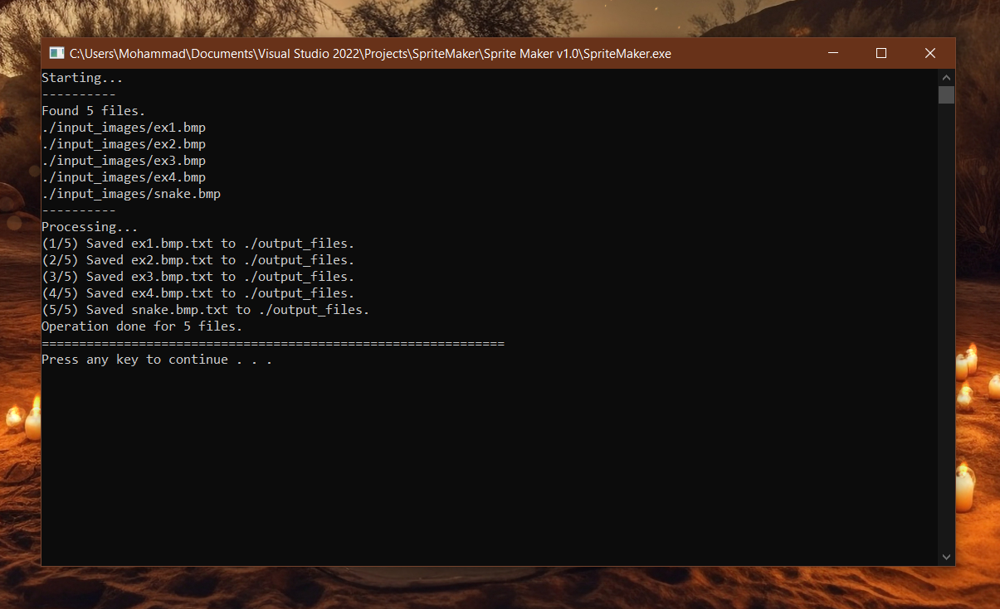

# SpriteMaker - Turn Your Pixels into C++ Spaghetti

Yo! Welcome, nerd. This is **SpriteMaker**, a spicy little tool designed to convert image files into mountains of `gfx.PutPixel()` calls so you can paste them into your Chili Framework games and watch your framerate spontaneously combust under the weight of thousands of pixels. Good times.

---

## 🔥 What Does This Do?

Here’s the deal, chief:

- You slap some images into a folder called `./input_images/`
- You run this program
- It churns out `.txt` files stuffed with lines like:

    ```cpp
    gfx.PutPixel(x, y, r, g, b);
    ```

- You paste those lines into a function in your Chili game code
- Boom — instant sprite, now you’re a graphics programmer. High-five.

---

## 🛠️ How to Build This Thing Yourself

Wanna build it yourself like a real programmer? Here’s what you need:

### 🧱 Requirements

- C++17 or newer (because `std::filesystem`)
- Visual Studio 2019/2022 or anything that supports C++17
- No external libraries to link — it's header-only thanks to `stb_image`

### 🗂 Folder Structure

Make sure your project has something like this:

SpriteMaker/\
│\
├── input_images/ # Where your images go\
├── output_files/ # Where the .txt results will be saved\
├── stb_image/ # Contains stb_image.h and stb_image_write.h\
├── Image.h / Image.cpp # The image processing logic\
├── utils.h # Folder scanning helpers\
├── SpriteMaker.cpp # The main file\
└── README.md # This file, probably

### 🧪 Build Steps (VS Example)

1. Open your `.sln` or create a new empty project.
2. Add the `.cpp` and `.h` files to the project.
3. Right-click the project > **Properties** > **C/C++ > Language** > Set **C++ Language Standard** to **ISO C++17** or later.
4. Build. Run. Eat chips.

> 🚫 Don’t forget to create the `input_images/` and `output_files/` folders or the app will cry.
---

## 💾 Requirements (Don’t Skip This, I Know You Will)

- **C++17 or higher**

    This program uses the `std::filesystem` library.  
    That means:
    
    - Set your compiler standard to **C++17** or above.  
    - Don’t @ me when it fails on C++98.

- Works on Windows (because Chili)

---

## 🎯 How It Works (For Those Who Actually Read)

1. Create these two folders in the same place as `SpriteMaker.exe`:

    ```
    ./input_images/
    ./output_files/
    ```

2. Dump your images into `./input_images/`.

3. Run the program:

    ```
    SpriteMaker.exe
    ```

4. The program will:
    - Find all images in `./input_images/`
    - Process each one pixel by pixel
    - Create a file like:

        ```
        ./output_files/snake.bmp.txt
        ```

    - Each output file contains thousands of lines like:

        ```cpp
        gfx.PutPixel(x, y, r, g, b);
        ```

5. Open your `.txt` file, copy all the lines into a C++ function like this:

    ```cpp
    void DrawSprite(Graphics& gfx)
    {
        gfx.PutPixel(...);
        gfx.PutPixel(...);
        // And so on
    }
    ```

6. Call your function in the Chili Framework game loop.  
   Boom — sprite on the screen.

---

## 🖼️ What Image Files Can You Feed This Beast?

SpriteMaker uses [stb_image.h](https://github.com/nothings/stb) under the hood.  
So it’s pretty chill with lots of formats:

✅ **JPEG** baseline & progressive (but NOT:
   - 12-bit-per-channel JPEGs
   - arithmetic-coded JPEGs)

✅ **PNG**:
   - 1/2/4/8/16-bit per channel

✅ **TGA** (subset support)

✅ **BMP**:
   - anything except 1bpp and RLE-compressed BMPs

✅ **PSD** (composited view only, no extra channels)

✅ **GIF**:
   - returns 4 channels (RGBA)

✅ **HDR** (Radiance rgbE format)

✅ **PIC** (Softimage PIC)

✅ **PNM**:
   - binary PPM and PGM only

So basically: if it’s an image, there’s a good chance this thing can munch it up.

---

## 🖼️ Screenshot

Here’s SpriteMaker doing its thing — converting images into glorious PutPixel spaghetti:



---

## 🎁 Included Example Files

I’m not leaving you high and dry, partner. Inside the repo, look in:

/input_images/

I dropped a few BMP files in there for testing or messing around. Try running the program as-is and watch the magic happen.

---

## 👨‍🏫 Why Would I Even Want This?

Because typing thousands of `PutPixel` calls by hand is:

- dumb
- soul-crushing
- not something I’d wish on my worst enemy

Now you don’t have to. Let the robot do it.

Happy sprite making, ya filthy animals.

— **Chili (but not really, this is your boy’s project)**

---

## 🤝 Contributing

Wanna make this tool better? Smash that fork button, submit a PR, or just yell at me in the issues section.

Bug reports, feature ideas, or code improvements — it’s all welcome!

Just keep it spicy. 🌶️

---

## ⚠️ License

**This project has NO LICENSE.**  
It’s basically “all rights reserved.” You can:

- clone it
- use it privately
- learn from it

…but you technically **can’t redistribute it or use it commercially** unless you get explicit permission from the author (me).

Use at your own risk. No warranty, express or implied.  

> Don’t sue me, bro.
